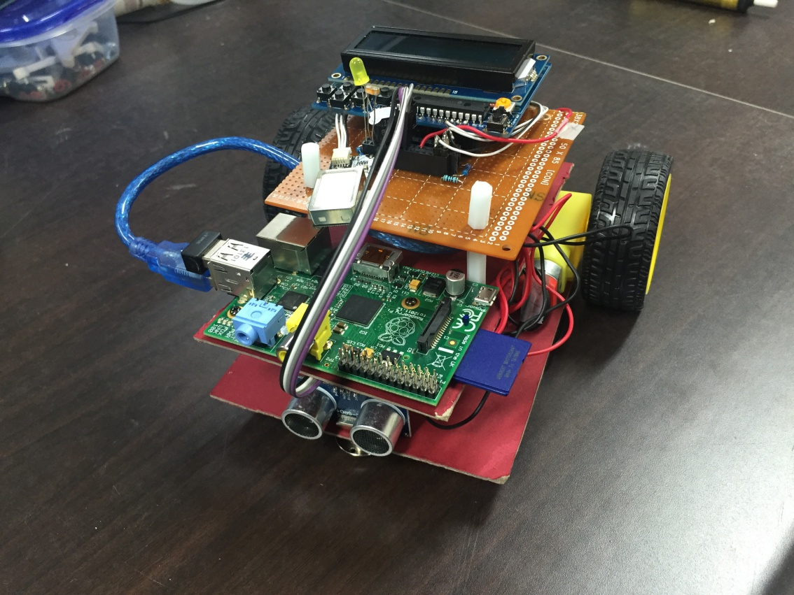
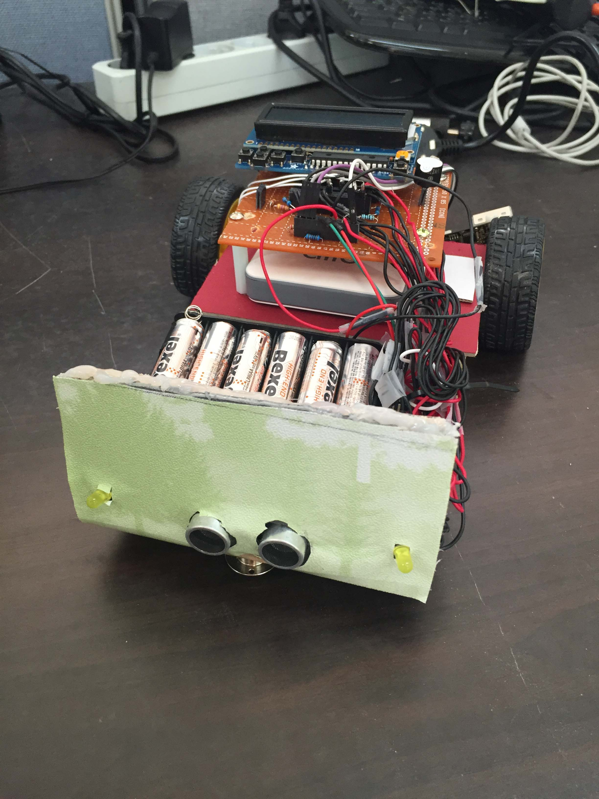

# RC Car project

## 여담
학교에서 임베디드 관련 수업에서 진행한 프로젝트.  
도어락 프로젝트에 이어 두 번째 `아두이노`를 이용한 프로젝트이다.  

`라즈베리 파이 카메라`를 사용하여 실시간 화면을 출력하고 싶었으나, 부족한 실력탓에 스마트폰의 `IP-CAM` 을 이용한점이 아쉽다.  
처음으로 `라즈베리 파이`를 사용해 보게 되었고, 리눅스를 배우고, 통신을 위해 `파이썬`을 접해 본 된 계기가 되었다.  
하드웨어를 직접 설계해보니 저항, 물리적인 위치와 구조, 배선, 전력 등 고려할게 정말 많다는 것을 배우게 되었다.  

`아두이노`가 센싱과 동시에 출력, 통신까지 해야 했는데, 구조상 `Loop 함수`만 돌기 때문에 어려운 점이 있었다.  
`Timer`라는 라이브러리를 이용해 이를 해결하였다.

1차적으로 정해진 라인을 따라가는 `라인 트레이서`를 완성하였다.  
`빵판(Bread Board)`을 이용하지 않고 직접 납땜을 하여 대부분을 제작하였다.  
~~최대한 적은 돈으로 구현하였고, 미관에 신경을 쓰지 않아 작품이 이쁘지는 않다.~~  

## 프로젝트 명세
자동차를 컨셉으로 한 `RC Car` 이다.  

앞쪽에는 `캐스터`를 달아 중심만 잡아주고, 뒤쪽에는 2개의 `DC Motor`를 장착하여 구동된다.  
`App`을 통해 자동차의 전방 화면을 보며 원격 조정이 가능하다.  
모드 설정을 통해 `라인 트레이서` <-> `RC Car` 간 전환이 가능하다.  
`RC Car`모드에서 전방에 장애물이 있으면 전진 명령이 오더라도 전진하지 않는다.  
`PM`으로 프로젝트를 총괄하였으며, `HW 개발`과 `라즈베리 파이` 서버 개발을 담당 하였다.  

## 진행기간  
2015.09.24 ~ 2015.12.17  

## 주요 기능
* **라인 트레이서**  
바닥에 있는 선을 따라간다.  
5개의 `수광/발광 센서`의 세트로 구성되며, 센싱된 값의 조합에 따라 특정 방향으로 회전을 한다.  

* **메뉴**  
전원 인가시 `16*2 캐릭터 LCD 모듈`을 통해 GUI가 있는 메뉴를 출력한다.  
최초 부팅 및 일정 시간 이상 지나면 잠금모드로 돌입하며, 이를 해제하기 위해서는 `지문 인식 모듈`로 로그인이 필요하다.  
잠금모드에서는 설정값을 바꿀 수 없다.  
동작 속도, LED 작동 방식, 장애물 감지 설정 여부, 장애물 감지 거리 등의 설정이 가능하다.  

* **초음파 센서**  
`RC Car`모드에서 전방의 장애물과의 거리를 측정하여, 일정 거리 이하가 되면 전진하지 않도록 구현했다.  

* **라즈베리 파이**  
`아두이노`는 `라즈베리 파이`와 연결되어 통신을 한다.  
`라즈베리 파이`는 `Python` 으로 서버가 돌아가며, `App`과 통신한다.  
`아두이노`가 직접 `App`과 통신 가능한 재료가 없어서 이런 방식으로 구현하게 되었다.  

* **카메라**  
`App`에서 `IP-CAM`을 통해 받은 화면을 출력해주고, 이를 보며 원격 조정이 가능하다.  
